# <strong style="color:yellow">Benny Graphyx Interview</strong>
## An interview Assessment terminal for candidates applying for new roles at the Benny Graphyx Company.

This is a command-line application for the Benny Graphyx job candidates to use this application to test the knowledge of the candidates that are applying for new roles in the company. In this application, the candidates will have to answer ten job-based questions. After they have provided their answer in the input space, the application will assess the input to see if it is CORRECT or WRONG. At the end of the quiz, if the candida obtains a certain mark in percentage, then they will be notified if they qualify for the role or not. After that then the name of the candidates will be exported to a google sheet for the assessors to see from their end.
[LINK TO INTERVIEW SITE](https://bg-interview-assessment.herokuapp.com/)

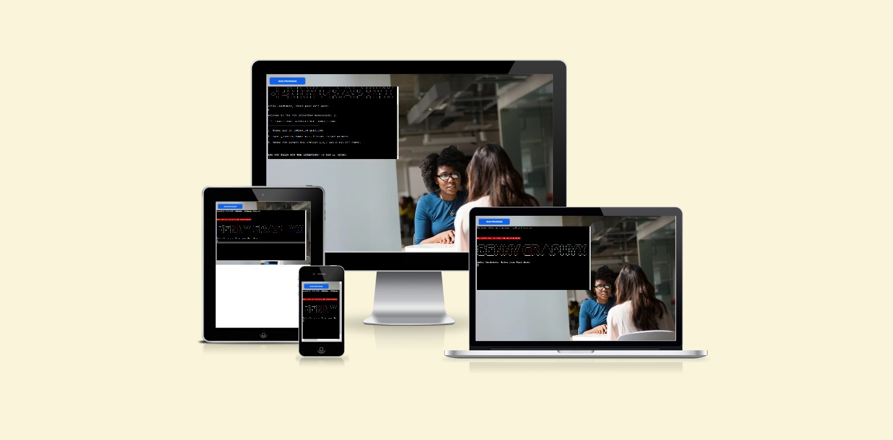

# FEATURES
## Welcome interface
* Pyfiglet and Colorama were installed and imported to generate ASCII art for the title and subtitle of the page. This helps to highlight information on the welcome page.
* I also added a background to the page to make it a bit interesting to the user since the terminal application is a bit restricted with designs and layout
* The Welcome page displays a welcome message and also gives a bit of detail about what the site is all about.
* Here the full name of the Candidate is requested to be entered.


### <strong>INVALID NAME ENTRY</strong>
* If no full name is entered the application will reject the user and ask again to enter a full name. However, if the user presses enter without inputting a name an error will appear.


### <strong>VALID NAME ENTRY</strong>
* If a name or character is then entered, the program will proceed to the next step. And since it is an Interview assessment we require the users to enter their full name as to what is on the application.

* I need specific instructions on how to utilize the interview application as a user.
    * The user receives a personalized welcome message after entering their name along with a summary and straightforward assessment instructions. To make some of the text lines here easier to read, I spaced them out using newline characters.

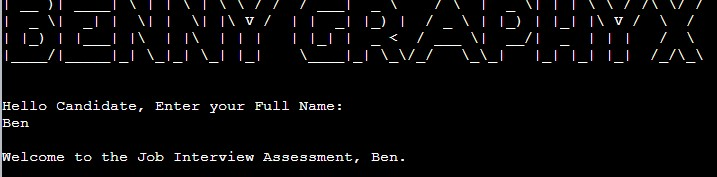
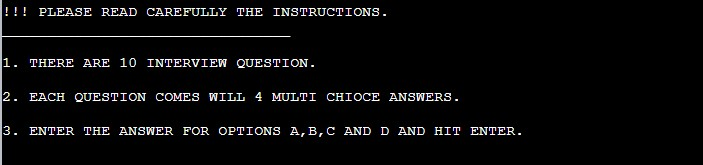

The user is then asked if they are ready to tote the interview by typing 'y' for yes or 'n' for no.  This permits user initiation and control of the flow chart at this level of the program. If the user hits "y," the interview will start, and if they type "n," the program will close with a goodbye message.

Any other character other than "Y" or "N" will prompt the user that the entry is INVALID and that they must type "Y" or "N" to continue or exit.
### <strong>INVALID ENTRY</strong>
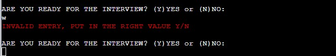
### <strong>'Y' ENTERED</strong>
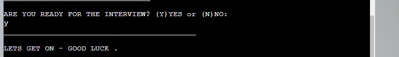
### <strong>'N' ENTERED</strong>
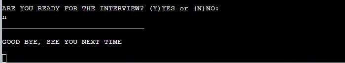

### <strong>DISPLAY QUESTIONS WITH 4 OPTIONS TO CHOOSE 1</strong>
Each question and its associated four answers are displayed one at a time.
The user is then given a spot to input their response with the choices a, b, c, and d.
The question will go on to the next one when the answer has been entered, with dashes separating them.

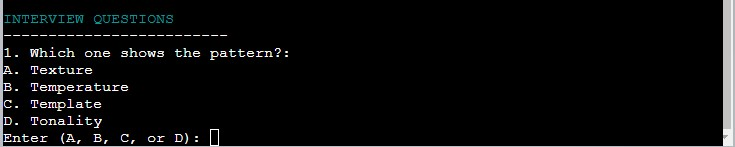

When the correct entry is made the application will display a <strong><span style="color:green">CORRECT</span></strong> in green text and if the wrong answer is entered, the application will display <strong><span style="color:red">WRONG</span></strong> in a red test.

Enter Answer

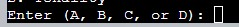

Correct Answer

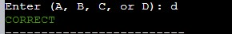

Wrong Answer

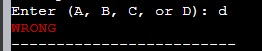

### <strong>OVERALL MARKS AND STATUS CONFIRAMTION</strong>
After the candidate goes through all the questions and answers them according to his or her strength, the overall marks will be displayed in percentage with all the correct answers and also candidate answers entered.

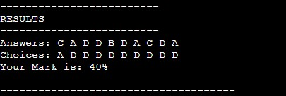

The application will also display the status of the candidate after achieving a certain high mark. This will display whether the candidate has been taken or not.

 


The Overall Mark of the Candidate will be exported to the Google sheet linked to the application for the assessors to know the people they are taking for the role vacant in the company.

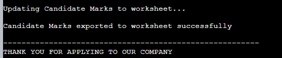
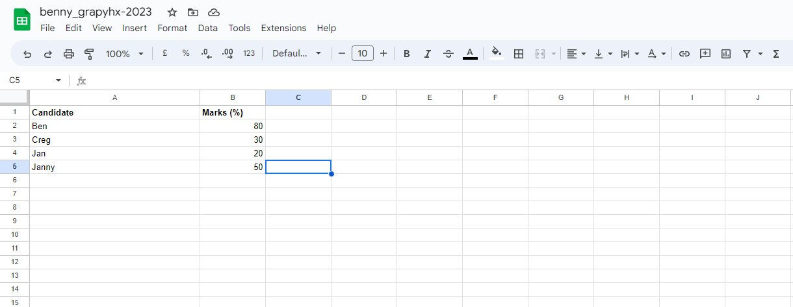


### <strong>Data Model</strong>
To store the question and response information for the interview, I utilized a dictionary in this application. I structured the code in a way that any updates to the dictionary may be made without requiring changes to any other functionality. The user result and the total number of questions in the dictionary are always presented with accurate data thanks to the usage of f-Strings in print statements.

## <strong>Future Features</strong>
The question is the same so in future, there can be randomizing the question.
In the feature, there will be a timer for the interview questions which will help reduce plagiarism on the side of the candidate

---
# <strong style="color:yellow">DESIGN</strong>
I made a straightforward flowchart showing the anticipated logic flow of the program from beginning to end using draw io. This made it easier for me to start imagining the code's structure and potential functional requirements.

The software gives the user feedback at several points to let them know if they made a mistake; for instance, if they don't input a name at the beginning, they are told to do so to move on.

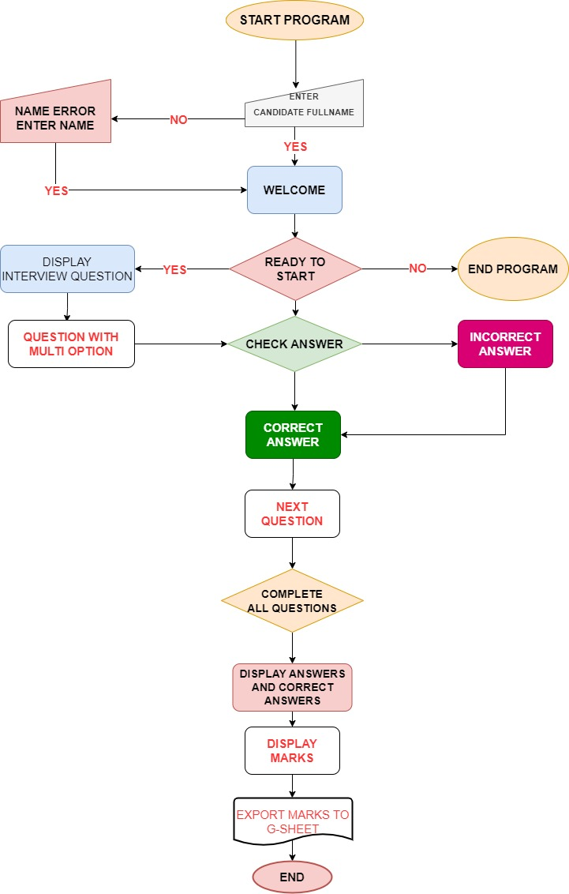

---
# <strong style="color:yellow">USER EXPERIENCE</strong>
### <b>Project goal</b>
* Provide the candidate with a pleasant, interesting, and simple multiple-choice interview assessment test.
* To improve the user experience, add some aesthetics with the usage of pictures and colour.
* All candidate inputs should receive a suitable answer, and any incorrect data should be handled correctly.

### <b>User Stories</b>
* As a candidate for the interview test, I want to be able to have a clear understanding of how to use the application since I need to get a new job
* it is important for me the user get access to instructions on how to use the application.
* To receive a notification when my input is incorrect and to be given the chance to change any incorrect input without stopping the app's operation.
* To be able to read the application output.
* To see my total marks and the assessment status for the interview.

---
# <strong style="color:yellow">TECHNOLOGIES</strong>
Python - used entirely for the app to initialize user and app commands.

HTML - The structure of the Homepage and Quiz game page were developed using HTML as the main language.

Javascript - there was a mockup js file in the template.

GitHub - The source code is hosted on GitHub and deployed using Git Pages.

Git - Used to commit and push code during the development of the Website
The site was created using Gitpod and pushed to GitHub to the remote repository.

---
### <b>Libraries, frameworks and others</b>
[Colorama](https://pypi.org/project/colorama/) for adding colour to fonts.

[Pyfiglet](https://pypi.org/project/pyfiglet/0.7/) for adding ASCII art.

[G-Spread](https://pypi.org/project/gspread/) is used to initialize the export of the marks onto a google sheet.

[Time-sleep](https://docs.python.org/3/library/time.html) is used for loading times in displaying information.

[Draw io](https://app.diagrams.net/) was used to create the Flowchart.

[Heroku](https://www.heroku.com/) used for deploying the website live - Cloud Application Platform.

[CI Python Linter](https://pep8ci.herokuapp.com/#) is used to check for errors in the code.

Microsoft Snipping Tool for screenshots

---
# <strong style="color:yellow">TESTING</strong>
The code was run through the Code Institute Python Linter and showed no errors.
The first test came out with some errors which were fixed according to the information given by the validator.

### <b>CI Linter with Errors</b>
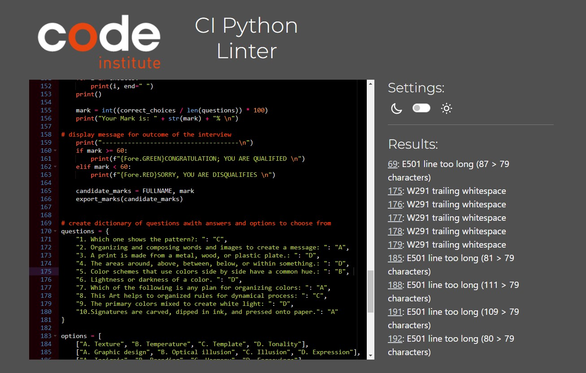

### <b>CI Linter with Errors Fix</b>
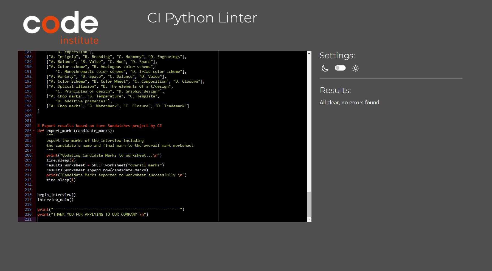

### <b>Bugs</b>
+ When a user entered the space to enter the full name and then presses enter, it bypasses validation into the next stage.
    + Fixed by ```while not FULLNAME.strip():```

+ Initial the statement ```ARE YOU READY FOR THE INTERVIEW? (Y)YES or (N)NO:``` accepts 'Y' and progress but any other character to quit instead of on 'N'. 
    + Fixed with the ```while True:``` to loop through plus ```continue``` and ```break```.

---
# <strong style="color:yellow">DEPLOYMENT</strong>
Deployment was done at the start of the project to allow device testing throughout the development process.

My project was deployed via Heroku as follows:
1.  Remove unused imports from the run.py file.
2.  Add dependencies in GitPod to the requirements.txt file with the command "pip3 freeze > requirements.txt".
3.  In the Heroku account, go to Dashboard and click ‘Create New App’. Give the app a unique name and select the region (Europe).
4.  The next page you will see is the project’s Deploy Tab. Click on the Settings Tab and scroll down to Config Vars.
5.  Click Reveal Config Vars and enter port into the Key box and 8000 into the Value box and click the Add button.
6.  Next, scroll down to the Buildpack section click Add Buildpack select python and click Save Changes.
7.  Repeat step 6 to add node.js., Note: The Buildpacks must be in the correct order. If not click and drag them to move into the correct order.
8.  Scroll to the top of the page and now choose the Deploy tab.
9.  Select Github as the deployment method.
10. Confirm you want to connect to GitHub.
11. Search for the repository name and click the connect button.
12. Scroll to the bottom of the deploy page and select the preferred deployment type:
13. Click either Enable Automatic Deploys for automatic deployment when you push updates to GitHub.

---
### <b>Version Control</b>
---
***Gitpod is an open-source developer platform automating the provisioning of ready-to-code developer environments.***

The following git commands were used throughout development to push code to the remote repo:

```git add .``` - This command was used to add all updated file(s) to the staging area.

```git commit -m “commit message”``` - This command was used to commit changes from the staging area to the local repository queue ready for the final step.

```git push``` - This command was used to push all committed code to the remote repository on Git Hub so it is safe and secure.

***Git add, git commit and git push are necessary to update the website anytime there are changes in the code***

Select the correct branch for deployment from the drop-down menu and click Deploy Branch for manual deployment.

---
# <strong style="color:yellow">CREDITS</strong>
I watched a lot of python tutorials along with Code Institute materials to get a deeper understanding of the python language.
+ I watch videos from these youtube channels
    + AmigosCode
    + Programming with Mosh
    + Teddy Smith
    + Bro Code

+ The interview questions and structure of the code were done by round the help of the video tutorials by Bro Code.

+ Exporting results functionality based on the Love_Sandwiches demo project by CI.

### <b>Acknowledgement</b>
I want to appreciate my mentor Daisy Mc Girr for her time and efforts invested in me.

The background image was taken from [Pexel](https://www.pexels.com/de-de/).